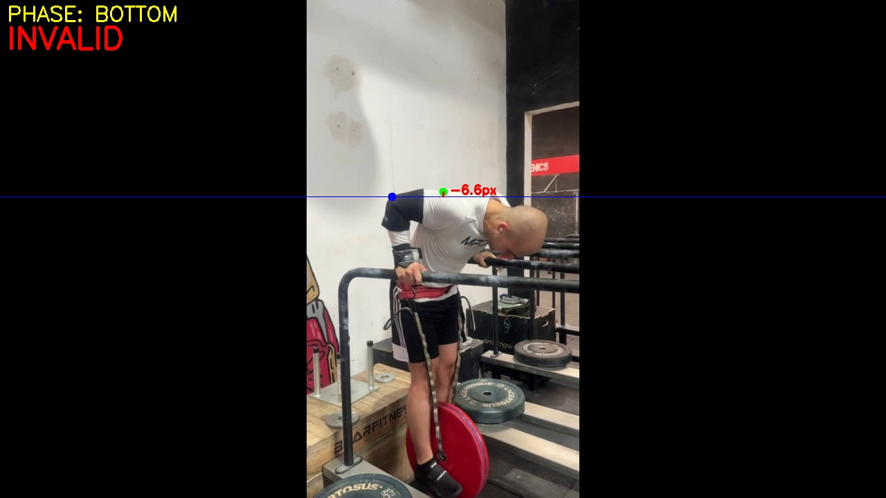

# Streetlifting Dip Validator

> ⚠️ **WORK IN PROGRESS**:  This is an early prototype. Features may change and accuracy is not guaranteed.

AI-powered tool to analyze parallel bar Dips and determine lift validity based on depth rules.

---

## 📸 Examples

### ✅ VALID Dip

*D (Green) touches/passes below E (Blue) line **VALID (+10.0px margin)***

### ❌ INVALID Dip

*D fails to reach E line **INVALID (−2.3px margin)***

---

## What It Does

Analyzes smartphone video of parallel bar Dips and outputs:
- **VALID / INVALID** decision based on depth rule
- Annotated overlay video with landmarks and phases
- JSON report with margins, confidence, and per-frame trace

## The Rule

A dip is **VALID** if the posterior deltoid (**D**) reaches or goes below the elbow line (**E**) at any point.

```
margin = y_D - y_E  (Y increases downwards)
VALID = max(margin) >= 0
```

---

## How It Works

| Step | Description |
|------|-------------|
| **Pose Estimation** | RTMPose (17 keypoints) via `rtmlib` |
| **Landmark Refinement** | Geometric estimation of D and E from arm vectors |
| **Phase Detection** | Savitzky-Golay smoothing on depth signal |
| **Decision** | Best margin across entire video |

---

## Usage

```bash
# Install
pip install -e .

# Run
python -m dip_validator input_videos/video.mp4
```

## Output

```
output/<video_name>/
├── overlay.mp4          # Annotated video
├── report.json          # Full analysis data
├── debug_landmarks.jpg  # Bottom frame visualization
└── debug_pose.jpg       # Pose keypoints
```

---

## Tech Stack

- Python 3.10+
- [rtmlib](https://github.com/Tau-J/rtmlib) (RTMPose)
- OpenCV, NumPy, SciPy
